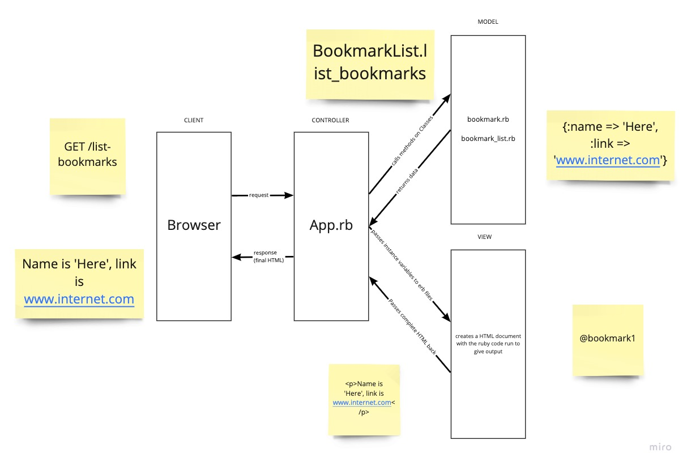

# Bookmark_manager

## Domain Modelling

In order to begin behaviour driven development, we created the following user story:

```
As a user
So that I can visit my favourite sites
I'd like to see a list of bookmarks
```

Below is our first domain model in order to start driving the development of the classes.


After browsing the walkthrough we have also added a process model.



## Approach

- Create a feature test to display a list of bookmarks
  - Pass by implementing expected string directly in controller
  - refactor to use view
- Created a Unit test for an #all method of the BookmarkList class
- Created Unit tests for #name and #link methods of the Bookmark class
- Refactored to include Model and View in passing the feature test for the list of bookmarks

## Database setup
```
CREATE DATABASE bookmark_manager;
\c bookmark_manager;
CREATE TABLE bookmarks(id SERIAL PRIMARY KEY, title VARCHAR(60), url VARCHAR(60));
\dt
```